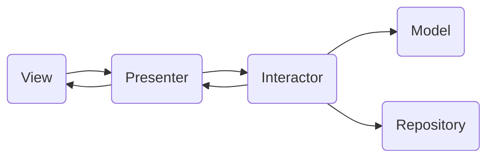

   
   

# Registrate App

This app in build on Java using the Android Studio IDE.
The patter used now is the MVP (Model Vie Presenter).

**View** is compose by the layout .xml and also the class Activities or Fragments.
**Model** are that models our data source.
**Presenter** en charge to communicate the View with the data source

The files are organized according this components in packages with the same name.
The interaction flow chart is specified here:

